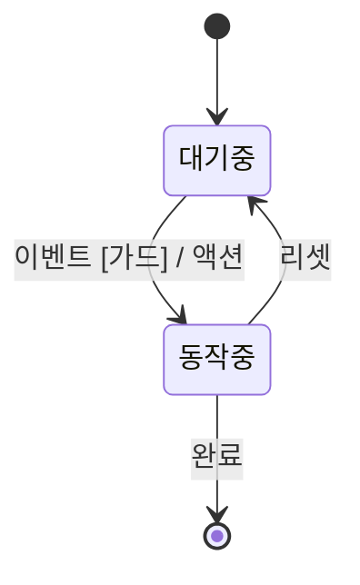
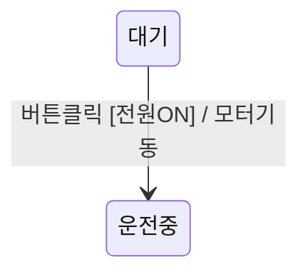
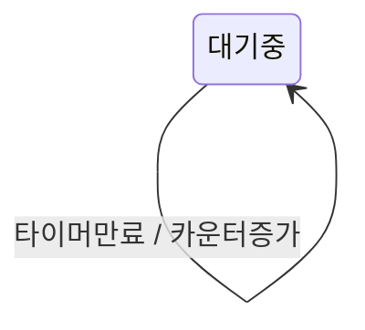
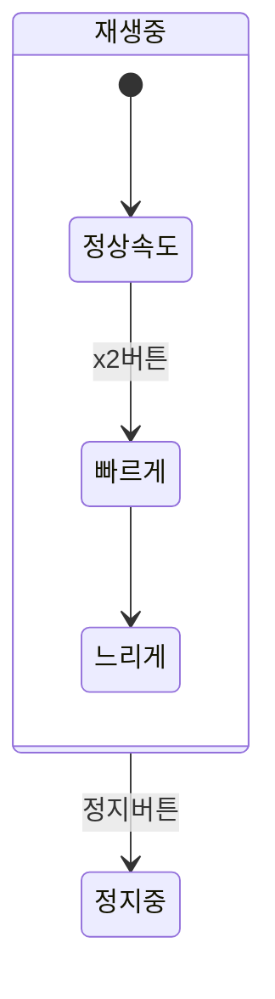
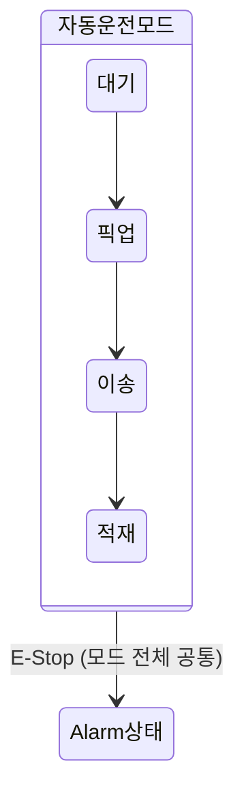
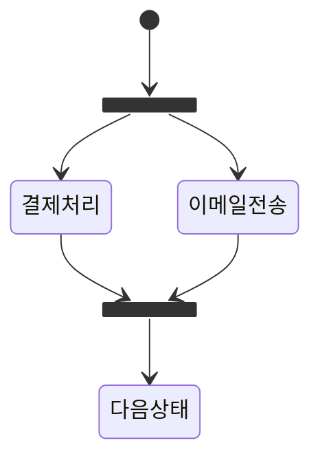
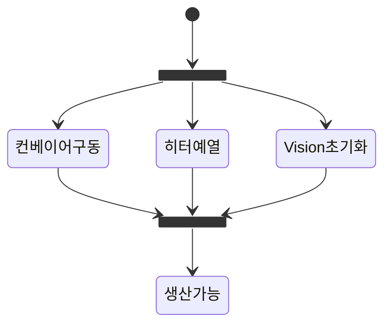
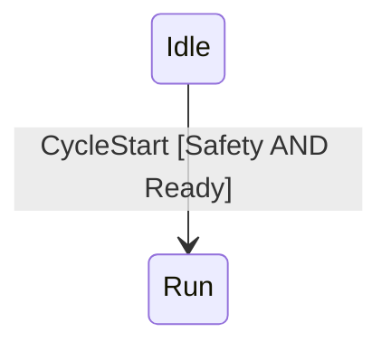

# State Machine Diagram 용어 정리

> **State Machine Diagram(상태 머신 다이어그램)** 이란?
> 하나의 객체(설비, 화면, 주문 등)가 살아있는 동안 **어떤 상태들을 거치며**, **무엇 때문에** 상태가 바뀌는지를 그림으로 표현한 UML 다이어그램입니다.
> PLC 시퀀스 제어로 비유하면 **스텝(Step) → 전이조건(Transition) → 다음 스텝**의 흐름과 동일합니다.

---

## 0. 큰 그림 — 한눈에 보는 구조



- **상태(State)** = 머무는 곳 (둥근 사각형)
- **전이(Transition)** = 상태와 상태 사이를 잇는 화살표
- **이벤트/가드/액션** = 화살표에 붙이는 "왜, 언제, 무엇을 하며" 옮겨가는지에 대한 정보
- `[*]` 시작 → **Initial State**, `[*]` 끝 → **Final State**

---

## 1. 핵심 구성 요소

### 🔵 State (상태)

객체가 **특정 시점에 가지는 조건이나 상황**. "지금 무엇을 하고 있는가" 또는 "지금 어떤 모드인가"를 나타냅니다.

| 항목 | 내용 |
|------|------|
| **표기** | 둥근 사각형 (모서리가 둥근 직사각형) |
| **이름 규칙** | 보통 **명사** 또는 **"~ing(~하는 중)"** 형태 |
| **포함 가능 정보** | entry / exit / do 액션, 내부 변수 등 |

**일반 예시**
- `대기 중`, `로그인됨`, `결제 완료`, `굽는 중`

**산업 제어 예시**
- `Home 위치 대기`, `이송 중`, `Vision 검사 중`, `Alarm 발생`

상태 박스 안에 담기는 정보 (예: `굽는 중`)

| 굽는 중 *(상태 이름)* | 실행 시점 |
|------|------|
| `entry/ ...` | 들어올 때 1회 실행 |
| `do/ ...` | 머무는 동안 계속 실행 |
| `exit/ ...` | 나갈 때 1회 실행 |

---

### ● Initial State (시작 상태)

객체가 **태어났을 때(생성됐을 때)** 시작하는 지점. "전원이 켜지면 가장 먼저 도달하는 곳"입니다.

| 항목 | 내용 |
|------|------|
| **표기** | 검은색으로 꽉 채운 원 `●` (Mermaid에서는 `[*] -->`) |
| **규칙** | **다이어그램(또는 영역) 당 정확히 1개**만 존재 |
| **특징** | 그 자체로는 "상태"가 아니라 **출발점**을 의미하는 의사 상태(pseudo state) |

> 💡 **헷갈리기 쉬운 점**: Initial State는 단순히 화살표의 시작점이지, 머무를 수 있는 상태가 아닙니다. 즉시 다음 상태로 빠져나갑니다.

---

### ◉ Final State (종료 상태)

객체의 **생명주기가 끝나는 지점**. 더 이상 이 객체는 어떤 상태도 갖지 않습니다.

| 항목 | 내용 |
|------|------|
| **표기** | 검은 점을 둘러싼 동심원 `◉` (과녁 모양 / Mermaid에서는 `--> [*]`) |
| **규칙** | **0개 ~ 여러 개** 가능 |
| **생략하는 경우** | 24시간 돌아가는 설비, 무한 루프 시스템 등 (= 끝이 없음) |

> 💡 **현실 비유**: 주문 객체는 `배송완료`나 `취소`에서 종료(◉)되지만, PLC 운전 사이클은 보통 종료점이 없고 `대기 ↔ 운전` 사이를 영원히 오갑니다.

---

### → Transition (전이)

**한 상태에서 다른 상태로 이동하는 화살표.** 다이어그램의 "동맥"입니다.

| 항목 | 내용 |
|------|------|
| **표기** | 방향이 있는 화살표 `→` |
| **라벨 위치** | 화살표 위 또는 옆 |
| **라벨 구성** | `이벤트 [가드] / 액션` (모두 선택사항) |



> 라벨 읽는 순서: **이벤트**(`버튼클릭`) → **가드**(`[전원ON]`) → **액션**(`/ 모터기동`)

---

### ⚡ Event / Trigger (이벤트, 트리거)

**전이를 일으키는 사건.** "왜 상태가 바뀌었는가?"의 답이 곧 이벤트입니다.

| 항목 | 내용 |
|------|------|
| **표기** | 전이 화살표의 라벨 (가장 앞쪽) |
| **유형** | 외부 신호, 시간 만료, 메서드 호출, 조건 변화 등 |

**일반 예시**: `결제 완료`, `타이머 만료`, `버튼 클릭`, `로그아웃`

**산업 제어 예시**: `센서 감지`, `Cycle Start 입력`, `타이머 T1 만료`, `Vision OK 신호`

---

### 🛡️ Guard (가드 조건)

**전이가 일어나기 위한 추가 조건.** 이벤트가 발생해도 가드가 거짓이면 전이는 **무시**됩니다.

| 항목 | 내용 |
|------|------|
| **표기** | 대괄호 `[ ]` 안에 조건식 작성 |
| **평가 시점** | 이벤트가 발생한 **그 순간** |
| **결과** | 참이면 전이, 거짓이면 전이 안 함 (이벤트는 사라짐) |

```
결제완료 [재고 > 0]
```
→ 결제가 완료돼도 **재고가 있어야만** `배송준비` 상태로 전이

**산업 제어 예시**
```
StartButton [SafetyDoor=Closed AND AirPressure>=4bar]
```
→ 시작 버튼을 눌러도 **안전문이 닫혀 있고 에어압이 4bar 이상일 때만** 운전 시작

> ⚠️ **주의**: 가드가 거짓이라 전이가 막혔을 때, 그 이벤트는 "보류"되지 않고 **버려집니다**. 같은 조건을 다시 만들고 싶다면 이벤트도 다시 발생해야 합니다.

---

### ⚙️ Action / Effect (액션, 효과)

**전이가 일어나는 순간 실행되는 동작.** 상태가 바뀌는 "찰나"에 일어나는 일입니다.

| 항목 | 내용 |
|------|------|
| **표기** | 슬래시 `/` 뒤에 작성 |
| **실행 시점** | 이전 상태 `exit` → **액션 실행** → 다음 상태 `entry` 순서 |
| **특징** | **즉시·1회성**으로 실행 (do 활동과 다름) |

```
결제완료 / 영수증발급
```

**산업 제어 예시**
```
EmergencyStop / 전원차단 + 알람기록
```

---

### 🔄 Activity (활동, do 액션)

상태에 **머무는 동안 계속해서 수행하는 동작.** 진행형 작업입니다.

| 항목 | 내용 |
|------|------|
| **표기** | 상태 박스 안에 `do/ 작업명` |
| **실행 시점** | entry 액션 완료 후 ~ exit 액션 직전까지 |
| **중단 조건** | 상태를 빠져나갈 때 자동 중단 |

| 굽는 중 | 비고 |
|------|------|
| `do/ 온도 유지` | 이 상태에 있는 한 계속 수행 |

**산업 제어 예시**

| 이송 중 | 비고 |
|------|------|
| `do/ 위치 피드백 감시` | 지속 수행 |
| `do/ 속도 프로파일 출력` | 지속 수행 |

> 💡 **Action vs Activity 차이**
> - **Action** (`/ 동작`) = 전이의 "순간"에 1회 발사 (총알처럼)
> - **Activity** (`do/ 동작`) = 상태에 있는 "동안" 계속 수행 (라디오처럼)

---

### 🚪 Entry / Exit Action (진입 / 퇴장 액션)

상태에 **들어올 때**, 또는 **나갈 때** 딱 한 번만 실행되는 동작.

| 종류 | 표기 | 실행 시점 |
|------|------|-----------|
| **Entry** | `entry/ 동작` | 상태에 들어오는 순간 1회 |
| **Exit** | `exit/ 동작` | 상태를 빠져나가는 순간 1회 |

| 대기 중 | 실행 시점 |
|------|------|
| `entry/ 타이머 시작` | 진입 순간 1회 |
| `exit/ 알람 끄기` | 퇴장 순간 1회 |

**전이 시 실행 순서 (요점 중의 요점)**

```
이전 상태 exit  →  전이 액션(/)  →  다음 상태 entry  →  다음 상태 do
```

**산업 제어 예시**

| 안전 정지 | 실행 시점 |
|------|------|
| `entry/ 출력 모두 OFF` | 진입 시 1회 |
| `entry/ Alarm Lamp ON` | 진입 시 1회 |
| `exit/ Alarm History 기록` | 퇴장 시 1회 |

---

### ↩️ Self-transition (자기 전이)

**같은 상태로 돌아오는 전이.** 화살표가 자기 자신을 가리킵니다.



| 항목 | 내용 |
|------|------|
| **특징** | 단순히 머무는 것이 아니라 **`exit → action → entry`가 다시 실행됨** |
| **활용** | 카운터 증가, 주기적 재초기화, 통계 갱신 등 |

> ⚠️ **Internal Transition과 구분**
> - **Self-transition**: exit/entry 재실행됨 (상태를 "나갔다 다시 들어옴")
> - **Internal Transition**: 같은 상태 안에서 액션만 실행, exit/entry 재실행 **안 됨**
>   (예: `대기중` 상태 안에 `키입력 / 화면갱신` 한 줄 → entry/exit 안 탐)

---

### 📦 Composite State (복합 상태)

**내부에 또 다른 상태들을 품고 있는 상위 상태.** 큰 상자 안에 작은 상자들이 들어있는 구조입니다.



| 활용 이유 | 설명 |
|----------|------|
| **추상화** | 상위 다이어그램은 단순하게, 세부는 안쪽에서 |
| **공통 전이** | 외곽 박스에서 빠지는 전이 1개 = 내부 모든 상태에서 빠지는 것과 동일 |

**산업 제어 예시** — `E-Stop`은 모드 전체에서 공통으로 빠져나감



---

### ⏸️ Fork / Join (분기 / 결합) — 병렬 처리

여러 일이 **동시에** 일어나는 것을 표현합니다.

| 구분 | 의미 | 비유 |
|------|------|------|
| **Fork** | 하나의 전이에서 **동시에** 여러 상태로 진입 | "여러 갈래로 갈라짐" |
| **Join** | 여러 상태가 **모두 끝나야** 다음 상태로 진행 | "다 모일 때까지 기다림" |

**표기**: 두꺼운 검은 막대 (Mermaid에서는 `<<fork>>` / `<<join>>`)



**산업 제어 예시**



- **Fork**: 운전 시작 시 `컨베이어 구동` + `히터 예열` + `Vision 카메라 초기화`를 동시에 진행
- **Join**: 세 작업이 모두 준비 완료돼야 `생산 가능` 상태로 진입

---

## 2. 전이 라벨 전체 표기법

```
이벤트명 [가드조건] / 액션
```

세 요소 모두 **선택 사항**이며, 필요한 것만 적습니다.

### 예시별 의미

| 라벨 | 의미 |
|------|------|
| `버튼클릭` | 이벤트만 — 버튼이 눌리면 무조건 전이 |
| `[온도≥180]` | 가드만 — 조건이 참이 되는 순간 자동 전이 (자동 전이) |
| `/ 알람울림` | 액션만 — 즉시 전이하며 액션 실행 (완료 전이) |
| `타이머만료 [온도≥180] / 알람울림` | 셋 다 — 가장 일반적인 형태 |

### 종합 예시
```
타이머만료 [내부온도 >= 180도] / 알람울림
```
> "타이머가 만료됐고(이벤트), 내부 온도가 180도 이상이면(가드),
>  알람을 울리며(액션) 다음 상태로 전이한다."

---

## 3. 자주 헷갈리는 개념 비교

### Action vs Activity
| 구분 | Action (`/`) | Activity (`do/`) |
|------|--------------|------------------|
| 위치 | 전이 화살표 위 | 상태 박스 안 |
| 실행 시점 | 전이의 "순간" 1회 | 상태에 머무는 동안 계속 |
| 중단 가능? | 너무 짧아 중단 불가 | 상태를 빠져나가면 중단 |

### Entry/Exit vs Action
| 구분 | Entry/Exit | Action (전이) |
|------|-----------|---------------|
| 트리거 | 어떤 경로로 들어오/나가든 항상 실행 | 그 **특정 전이**가 일어날 때만 |
| 위치 | 상태 박스 안 | 전이 화살표 위 |

### Self-transition vs Internal Transition
| 구분 | Self-transition | Internal Transition |
|------|-----------------|---------------------|
| exit/entry 재실행 | **O** (다시 실행됨) | **X** (그대로 유지) |
| 표기 | 자기 자신으로의 화살표 | 상태 박스 안에 한 줄 |

---

## 4. 요소별 한눈에 보기 (요약 표)

| 요소 | 표기 | 설명 | 1회성? |
|------|------|------|--------|
| **State** | 둥근 사각형 | 특정 시점의 조건/상황 | — |
| **Initial State** | `●` / `[*] -->` | 시작 지점, 영역당 1개만 | — |
| **Final State** | `◉` / `--> [*]` | 종료 지점, 0개 이상 | — |
| **Transition** | `→` | 상태 간 이동 화살표 | — |
| **Event/Trigger** | 라벨 앞부분 | 전이를 일으키는 사건 | 1회성 |
| **Guard** | `[조건]` | 전이의 추가 조건 | — |
| **Action/Effect** | `/ 동작` | 전이 시 실행되는 동작 | **1회성** |
| **Activity** | `do/ 동작` | 상태 내 지속 동작 | 지속적 |
| **Entry Action** | `entry/ 동작` | 상태 진입 시 1회 실행 | **1회성** |
| **Exit Action** | `exit/ 동작` | 상태 퇴장 시 1회 실행 | **1회성** |
| **Self-transition** | 자기 자신으로의 `→` | exit → action → entry 재실행 | 1회성 |
| **Composite State** | 상태 안의 상태 | 하위 상태를 품는 상위 상태 | — |
| **Fork/Join** | `<<fork>>` / `<<join>>` | 병렬 분기/결합 | — |

---

## 5. 작성 약속 (Conventions / Rules)

> 본 프로젝트에서 State Machine Diagram을 그리고 해석할 때 적용하는 약속들. UML 표준이 허용하는 여러 표기 중 **모호함을 줄이기 위해 고정한 규칙**입니다.

### 약속 1: Event 없음 ⇒ Guard 없음

Guard(`[조건]`)는 **어떤 이벤트가 발생한 순간에 평가**되는 필터입니다. 이벤트가 없는 화살표에 Guard만 단독으로 쓰지 않습니다.

```
✗ 모호:   ──[온도≥180]──▶
✓ 명확:   ──타이머만료 [온도≥180]──▶
```

> 💡 UML 표준은 `[조건]`만으로도 자동 전이(Completion Transition)를 허용하지만, 본 프로젝트에서는 **트리거가 되는 이벤트를 반드시 명시**합니다.

---

### 약속 2: Event + Guard 없음 ⇒ 무조건 Transition

Event가 발생했고 Guard가 적혀 있지 않으면, **추가 검사 없이 즉시 전이**가 일어납니다.

```
StartButton              ──▶  운전중   (StartButton 입력 즉시 전이)
StartButton [SafetyOK]   ──▶  운전중   (StartButton + SafetyOK일 때만 전이)
```

---

### 약속 3: 코드의 조건문과의 대응 — 무엇이 Event이고 무엇이 Guard인가

PLC/소프트웨어 코드의 `if` 블록을 State Machine으로 옮길 때:

- **외부에서 들어오는 트리거(왜 평가가 시작되는가)** = **Event**
- **그 트리거를 통과시켜도 되는 조건(필터)** = **Guard**

즉, **하나의 조건문**만 단독으로 있을 때는 그것이 Guard(혹은 단독 트리거)가 되고, **조건문 안에 또 다른 조건**이 중첩된 경우 **바깥쪽이 Event, 안쪽이 Guard**가 됩니다.

```
if (CycleStart) {              ← 트리거: 이벤트
    if (Safety && Ready) {     ← 필터:  가드
        goto State_Run;
    }
}
```



> **요지**: "왜 평가되었는가(trigger)" = Event, "통과해도 되는가(filter)" = Guard

---

### 약속 4: 동일 Event + 여러 전이 ⇒ Guard는 상호배타적

한 상태에서 **같은 Event**로 나가는 전이가 둘 이상이면, Guard끼리 **겹치지 않게** 작성합니다. 겹치면 어느 쪽이 선택될지 결정할 수 없습니다.

```
✗ 모호:
   Stop [Speed>0]    ──▶ Decel
   Stop [Speed>=0]   ──▶ Halt    ← Speed=5일 때 둘 다 참

✓ 명확:
   Stop [Speed>0]    ──▶ Decel
   Stop [Speed==0]   ──▶ Halt    ← 정확히 하나만 참
```

---

### 약속 5: Guard 거짓 ⇒ Event는 소멸 (큐잉되지 않음)

Guard가 거짓이라 전이가 막혔을 때, 그 Event는 **저장되지 않고 사라집니다**. 다음 사이클에 자동으로 다시 시도되지 않습니다.

```
StartButton [SafetyDoor=Closed]
```
→ 안전문이 열려 있을 때 StartButton을 눌렀다면 그 입력은 사라집니다.
→ 안전문을 닫은 뒤 **StartButton을 다시 눌러야** 전이가 발생합니다.

---

### 약속 6: Entry/Exit는 경로 무관, 전이 액션은 경로 특정

- **`entry/`, `exit/`**: 어느 방향으로 들어오든/나가든 **항상 실행**
- **전이 액션 `/`**: 그 **특정 전이가 일어날 때에만** 실행

→ 여러 진입 경로에서 공통으로 실행해야 할 동작은 **`entry/`에 두는 것이 안전**합니다.

---

### 약속 7: 전이 시 실행 순서는 고정

```
이전 상태 exit/  →  전이 액션 /  →  다음 상태 entry/  →  다음 상태 do/
```

이 순서는 절대 변경하지 않습니다. (예: action을 entry 뒤로 옮기는 표기 ✗)

---

### 약속 8: Initial State에서 나가는 전이엔 Event/Guard 없음

`●`(Initial State)에서 첫 상태로 가는 화살표는 **트리거 없이 즉시 발사**됩니다. Event나 Guard를 붙이지 않습니다.

```
✗ ●  ──Init [Ready]──▶ 대기중
✓ ●  ──▶ 대기중
```

---

### 약속 9: 상태/이벤트/액션 명명 규칙

| 요소 | 형태 | 예 |
|------|------|----|
| **State** | 명사 또는 "~중/~됨" | `대기 중`, `운전 중`, `로그인됨` |
| **Event** | 사건/입력의 명사 또는 수동형 | `버튼클릭`, `타이머만료`, `Vision OK` |
| **Action** | 명령형 동사구 | `알람울림`, `모터정지`, `로그기록` |
| **Guard** | 평가식(논리식) | `Speed=0`, `Safety AND Ready` |

---

## 6. 한 줄 정리

> **State Machine Diagram은 "지금 어디에(State) 있고, 무엇 때문에(Event), 어떤 조건에서(Guard), 무얼 하며(Action) 다음 어디로(Transition) 가는가"를 그리는 그림이다.**
